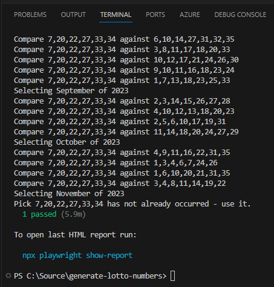

# generate-lotto-numbers

Generates a random number and validates it has not occurred in past Lotto Australia draws.

## Further Reading

- [The Lott](https://www.thelott.com/)

# Warning

Do not gamble. This project is not an endorsement of gambling. I built this project simply as an interesting exercise in webscraping, random number generation and probability.

# Background

In Australia, [The Lott](https://www.thelott.com/) is the organisation which runs the official lotteries, with millions to be won each week. While this may seem tempting, the odds of winning are tiny.

While exploring the probability space, I wondered how to select a number which had never been drawn before. Note that while this does not increase the probability of the number being drawn, it does provide an opportunity to write a technical solution to answer the question.

# Implementation

This project uses a Playwright test defined in TypeScript to scrape the historical draw numbers from The Lott's Powerball page. A randomly generated number is compared against this historical data. If there is no match, it returns success as a valid solution. This could be extended to scrape the other game options available beyond Powerball.

# Usage

```
npx playwright install
npm install -D @playwright/test
npx playwright test --headed
```

# Result

Running the above will show the below should the randomly generated number not have been used in a past draw.

